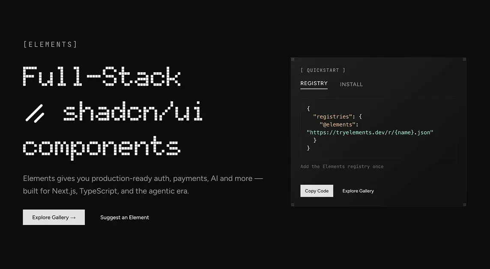
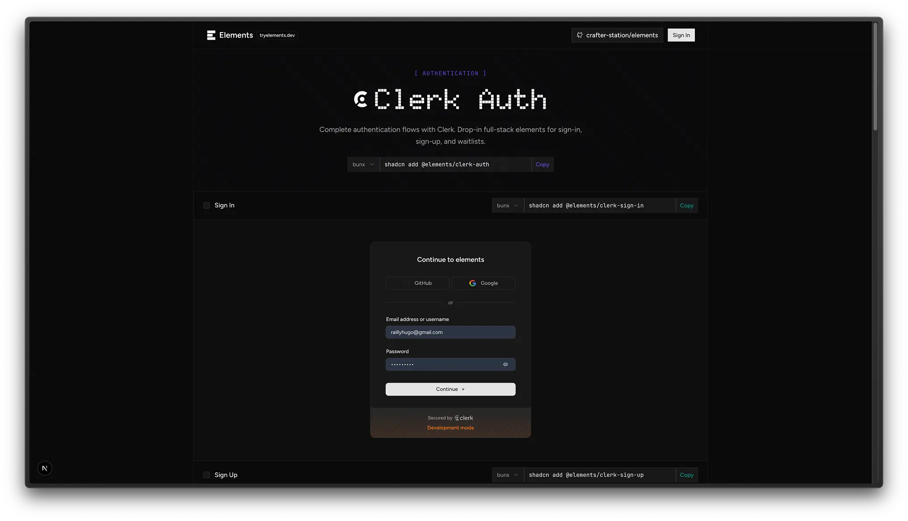
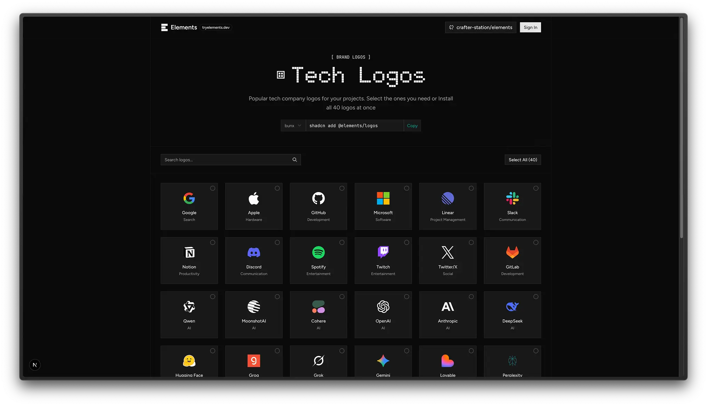

<p style="text-align: center;">
  <svg width="74" height="86" viewBox="0 0 37 43" fill="none" xmlns="http://www.w3.org/2000/svg">
    <style>
      @media (prefers-color-scheme: dark) {
        .icon-fill { fill: white; }
      }
      @media (prefers-color-scheme: light) {
        .icon-fill { fill: black; }
      }
    </style>
    <path class="icon-fill" d="M0.38324 12.6325V0.632477H12.3832V12.6325H0.38324ZM12.3832 12.6325V0.632477H24.3832V12.6325H12.3832ZM24.3832 12.6325V0.632477H36.3832V12.6325H24.3832ZM0.38324 27.6325V15.6325H12.3832V27.6325H0.38324ZM12.3832 27.6325V15.6325H24.3832V27.6325H12.3832ZM0.38324 42.6325V30.6325H12.3832V42.6325H0.38324ZM12.3832 42.6325V30.6325H24.3832V42.6325H12.3832ZM24.3832 42.6325V30.6325H36.3832V42.6325H24.3832Z"/>
  </svg>
</p>

<h1 align="center">Elements</h1>

Full-stack components ready for the agentic era. Install flows, not pixels.



## Quick Start

1. Add Elements registry to your `components.json` file:
```json
{
  "registries": {
    "@elements": "https://tryelements.dev/r/{name}.json"
  }
}
```

2. Install any element you want using the `bunx shadcn@latest add` command.
```bash
bunx shadcn@latest add @elements/logos
```

## Available Components

### Clerk Auth
Complete authentication flows with sign-in, sign-up, and waitlist components.



### Tech Logos
Popular brand logos collection with shopping cart functionality.



### Theme Switcher
Dark/light mode toggles with multiple variants.

**More coming soon...**

## Registry

Visit [tryelements.dev](https://tryelements.dev) to browse all components.

---

Built with Next.js, TypeScript, and shadcn/ui.
